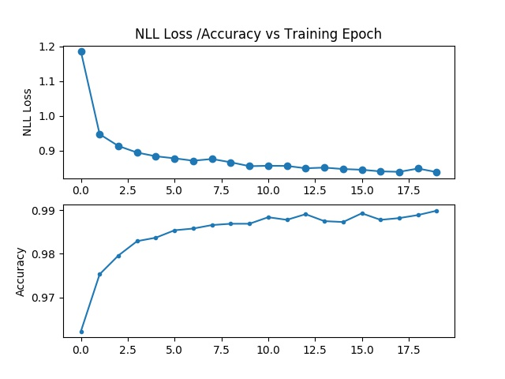
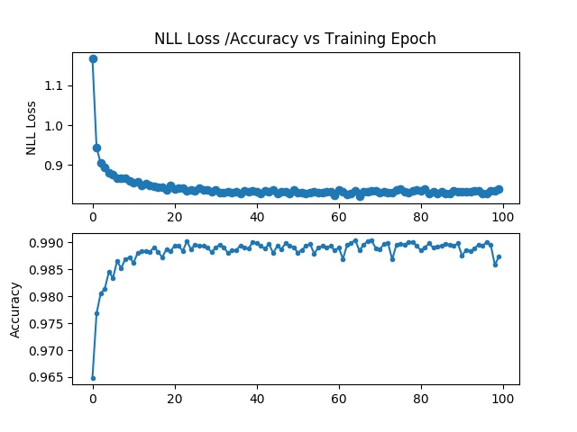
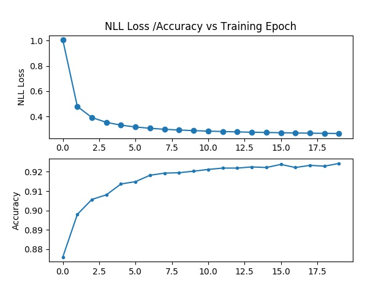
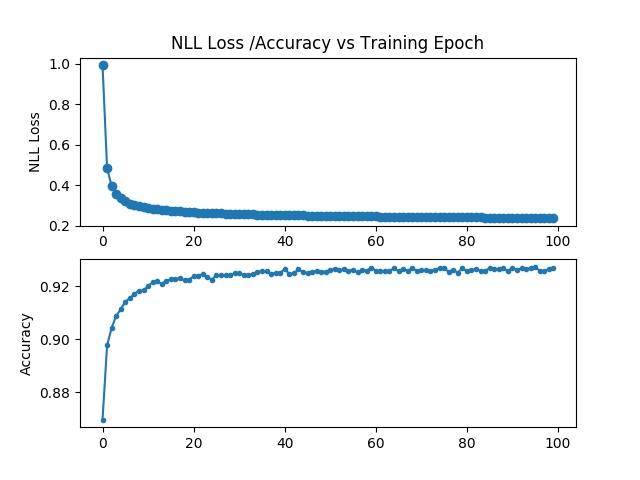

#  Brief Introduction

- Both the SVM model and the ANN model are implemented by using PyTorch, before start the testing, for the platform with **GPU**, please use `conda install pytorch torchvision cudatoolkit='TYPE YOUR CUDA TOOLKIT VERSION HERE' -c pytorch`
For the platform **without GPU**, please use `conda install pytorch-cpu torchvision-cpu -c pytorch` to install the CPU version.
- Developed by using Python 3.6
- Both the SVM and the ANN model are ***GPU accelerate available***
- Author: Tan Haochen
- Student ID: 55349692
- Do training:
`python main.py --model [CHOOSE FROM ann AND svm] --reset [False to READ THE CHECKPOINT] --epochs [ROUNDS OF TRAINING]`
**NOTE**: if epochs>30 rounds, please fix the learning rate adjust strategy from fix the learning rate every 5 epochs to fix the learning rate every 30 epochs.
- Do quick test by typing: 
`python main.py --test_mode True --model [CHOOSE FROM ann AND svm]`

# SVM and ANN

## Design of the Experiment
### ANN model
The first initial model shows as below:
```flow
st=>start: Reshape the input tensor from (Batch_size, Height, Weight) to(-1,Height*Weight)
op1=>operation: Linear Layer(Height*Weight, 64)
op2=>operation: Linear Layer(64, 128)
op3=>operation: Linear Layer(128, 64)
op4=>operation: Linear Layer(64, 10) and Classifier
op6=>operation: NLL Loss calculation and Adam method loss propagation
e=>end: Record the training loss and validation accuracy rate

st->op1->op2->op3->op4->op6->e
```
### SVM model
The svm model is actually to find out hyperplane to separate and classify the data. So it is easy to implement a linear SVM by using a Linear layer:

```flow
st=>start: Reshape the input tensor from (Batch_size, Height, Weight) to(-1,Height*Weight)
op1=>operation: Linear(Height*Weight, n_class)
op2=>operation: Classify
op3=>operation: calculate the loss of the n_class's output and minimize the loss
e=>end: Record the training loss and the validation accuracy rate

st->op1->op2->op3->e
```


## The Expriment Detail
### Process of Training
- Adam optimizer to do the optimization process without momentum
- With a start learning rate of 0.0001
- Multiply the learning rate with 0.1 every 5 epoch
- trained both two model with 20 epoch
- with a total size of 60000 images of training example shuffled

### Process of Validation

- Pytorch doesn't has a method to calculate the recall, precision, and the F1 score, so I implement a method to calculate the score. The validation set have 10000 images which different with the trainning examples.

## Experiment Result
 with whole dataset:
 
Model  | validation loss(20 epochs) | test accuracy | Recall for each class | Precision for each class |
------------- | ------------- | ------------- | ------------- | ------------- | 
SVM  | 0.26809 | 9246/10000 | 0.9806, 0.9797, 0.8973, 0.9059, 0.9308, 0.8599, 0.9572, 0.9173, 0.8963, 0.9098 | 0.9515, 0.9661, 0.9269, 0.9104, 0.9279, 0.9153, 0.9348, 0.9291, 0.8800, 0.8965 
ANN | 0.03317 | 9888/10000 | 0.9959, 0.9956, 0.9845, 0.9931, 0.9929, 0.9865, 0.9885, 0.9874, 0.9836, 0.9792 | 0.9859, 0.9938, 0.9903, 0.9853, 0.9898, 0.9854, 0.9896, 0.9883, 0.9866, 0.9920

***Conclusion: ***
With a large scale datasets, the ANN model outperforms the SVM

Try with 1/100 size of training sets:

Model  | validation loss(20 epochs) | test accuracy | Recall for each class | Precision for each class |
------------- | ------------- | ------------- | ------------- | ------------- | 
SVM  | 1.9540 | 2236/10000 | 0.9000, 0.0767, 0.0368, 0.6248, 0.0377, 0.1200, 0.2046, 0.1527, 0.0431, 0.0585 | 0.4000, 0.1779, 0.4810, 0.2129, 0.1602, 0.1404, 0.1671, 0.1397, 0.0800, 0.1317
ANN | 2.31986 | 1533/10000 | 0.3133, 0.0396, 0.1831, 0.1069, 0.4756, 0.4417, 0.0063, 0.0010, 0.0000, 0.0159 | 0.3126, 0.0439, 0.2221, 0.0813, 0.1254, 0.2199, 0.2609, 0.0357, 0.0000, 0.0731

***Conclusion: ***
for the ANN model:
The hyperparams all stacked in the linear layer, the covergence speed is low and the waste of computation is big, and also the performance of the model is not good. So I do some modify to the ANN model and change it to a mini CNN model

Try with 1/100 size of training sets:

Model  | validation loss(20 epochs) | test accuracy | Recall for each class | Precision for each class |
------------- | ------------- | ------------- | ------------- | ------------- | 
SVM  | 1.9540 | 2236/10000 | 0.9000, 0.0767, 0.0368, 0.6248, 0.0377, 0.1200, 0.2046, 0.1527, 0.0431, 0.0585 | 0.4000, 0.1779, 0.4810, 0.2129, 0.1602, 0.1404, 0.1671, 0.1397, 0.0800, 0.1317
CNN | 2.10822 | 5798/10000 | 0.9214, 0.9930, 0.3895, 0.7396, 0.7240, 0.0594, 0.7140, 0.6119, 0.2710, 0.2755 | 0.6596, 0.4619, 0.6689, 0.4457, 0.5520, 0.9298, 0.7703, 0.7727, 0.5581, 0.7056

## Figure of the trainning and validation
The loss and accuracy rate vs epoch curve:
for **ANN: **





for **SVM:**




